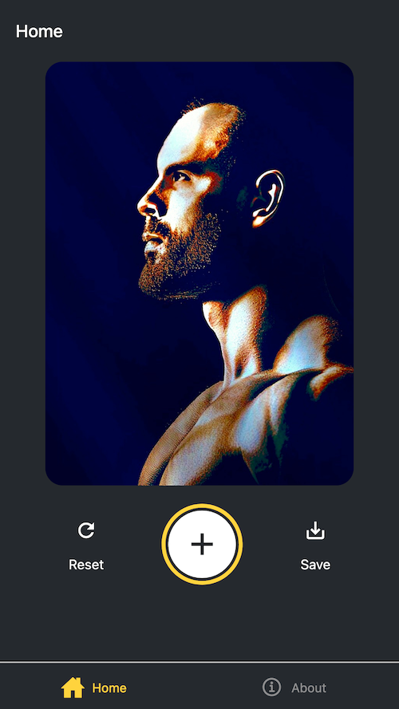
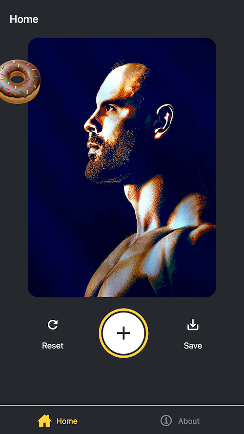

# Sticker Smash for ReactNative

<a href="https://tecnate.dev" target="_blank" rel="author">Tecnate</a> | Last Updated: 18 Nov 2024

<!-- TABLE OF CONTENTS -->

  
Table of Contents

  <ol>
    <li>
      <a href="#about-the-project">About The Project</a>
      <ul>
        <li><a href="#built-with">Built With</a></li>
      </ul>
    </li>
    <li>
      <a href="#getting-started">Getting Started</a>
      <ul>
        <li><a href="#prerequisites">Prerequisites</a></li>
        <li><a href="#installation">Installation</a></li>
      </ul>
    </li>
    <li><a href="#usage">Usage</a></li>
    <li><a href="#roadmap">Roadmap</a></li>
    <li><a href="#contributing">Contributing</a></li>
    <li><a href="#license">License</a></li>
    <li><a href="#contact">Contact</a></li>
    <li><a href="#acknowledgments">Acknowledgments</a></li>
  </ol>

<!-- ABOUT THE PROJECT -->

## About The Project

This is a tutorial project to learn about React Native using the Expo framework. See the [Source README](src-README.md) for the original documentation.

(<a href="#readme-top">back to top</a>)

### Built With

-   React Native
-   Expo React Framework

(<a href="#readme-top">back to top</a>)

<!-- GETTING STARTED -->

## Getting Started

Visit [Expo's Tutorial](https://docs.expo.dev/tutorial/introduction/) for step-by-step instructions to build the app.

### Prerequisites

N/A

### Installation

N/A

(<a href="#readme-top">back to top</a>)

<!-- USAGE EXAMPLES -->

## Usage

At the time of this update, if you follow the tutorial, your browser will throw an error at **Step 7: Handle Platform Differences**. To fix this:

1. Delete your **node_modules** directory.
    - `rm -rf node_modules`
2. Replace your **package.json** file's contents with that from the source repo.
    - Visit the original [Sticker Smash Repo](https://github.com/expo/examples/tree/master/stickersmash) on GitHub for files.
3. Reinstall your **node_modules** directory
    - `npm install`

(<a href="#readme-top">back to top</a>)

<!-- ROADMAP -->

## Roadmap

There are no plans to implement additional features at this time.

(<a href="#readme-top">back to top</a>)

<!-- CONTRIBUTING -->

## Contributing

This project is for learning/demonstration and is not being actively developed.

(<a href="#readme-top">back to top</a>)

<!-- LICENSE -->

## License

Distributed under the [MIT License](https://choosealicense.com/licenses/mit/).

(<a href="#readme-top">back to top</a>)

<!-- CONTACT -->

## Contact

Nate: [Website](https://tecnate.dev/) | [GitHub](https://github.com/nvsmith) | [Gravatar Profile](https://gravatar.com/nvsmith435)

(<a href="#readme-top">back to top</a>)

<!-- ACKNOWLEDGMENTS -->

## Acknowledgments

#### Expo React Framework - https://expo.dev/

#### README Template

-   [Best README Template](https://github.com/othneildrew/Best-README-Template/tree/master)

(<a href="#readme-top">back to top</a>)

